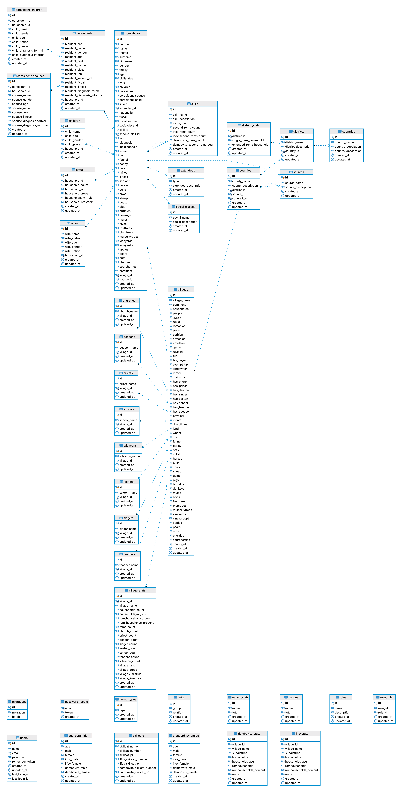

## Maprom Database

The Maprom Database is a web application designed to digitalize archive data from the 1836 Census of Wallacia. 

## 1. Requirements
Requirements are best determined using Server Requirements page of corresponding Laravel 5 version
Currently used version is 5.8.*

PHP version 7.2.*

SSH access to the server

Composer

## 3. Installation (for deploying your own application)

* Make sure that composer is installed globally or install it in place

* Clone the repository

* Move into the directory

* Install the dependencies. `composer install`

* Make sure that .env file is present (copy .env.example to .env) and configured with the configuration details for the server.

* Either create application key manually or do that with a command `php artisan key:generate`

* In the `.env` file, make sure that APP_ENV=production and APP_DEBUG=false for production environments (this should prevent unneeded error detailed data exposure)

* If you need to change the email configuration. Open the config/mail.php file and set the needed values within the from element

* Create the database with `php artisan migrate` (this should create database tables needed)

## Database

The database schema can be found in a pdf under public/pdf/db.

### Installed Packages
The following client libraries are installed and can be used with your Plugin. If you need other libraries you can add them via composer.

        barryvdh/laravel-elfinder
        consoletvs/charts
        sarfraznawaz2005/servermonitor
        twbs/bootstrap
        yajra/laravel-datatables-oracle
        
